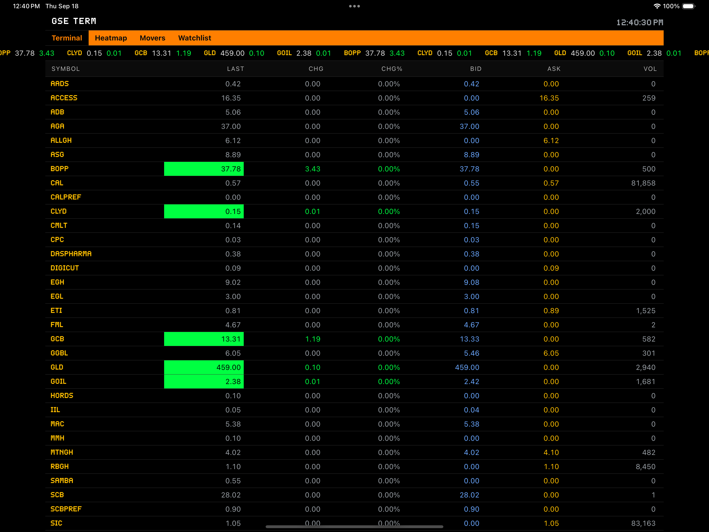
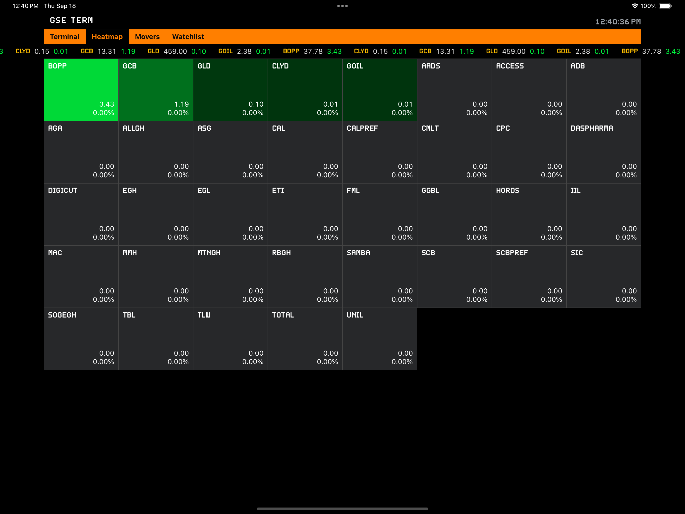
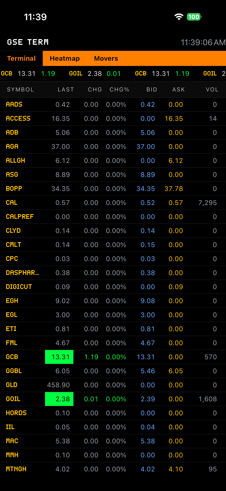

# GSE Terminal

A bloomberg like terminal for GSE(Ghana stock Market). Live prices, browse market listings, view detailed stock information by symbol, and manage a personal wishlist — all with a clean, responsive UI and theming support.

## Screenshots

<p align="left">
  
  
</p>




## How to run

1. Install dependencies

   ```bash
   npm install
   ```

2. Start the development server

   ```bash
   npx expo start
   ```

Then open the app in a development build, Android emulator, iOS simulator, or Expo Go as prompted.

## License

This project is intended for educational/demo purposes.
